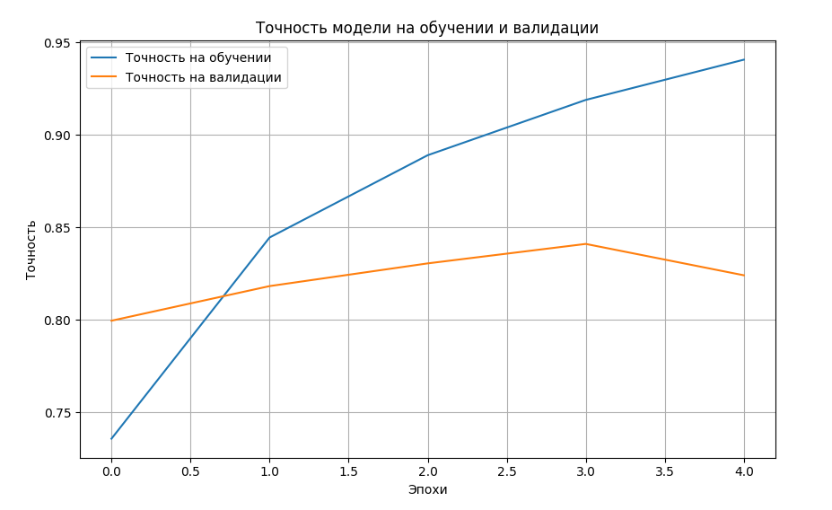
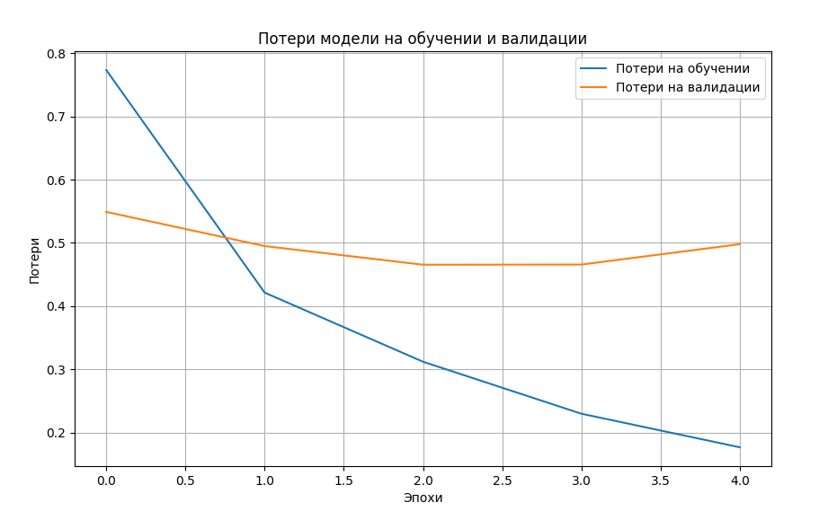

# Weather-Image-Classification

## Описание

Проект предназначен для классификации изображений, на которых изображены различные погодные условия и явления (например, радуга, дождь, туман). Модель использует предобученную MobileNetV2, дообучается на пользовательских данных и оценивается по точности и потерям на валидации

## Структура проекта
- `dataset/` - Папка для данных. Скачайте датасет по [ссылке](https://www.kaggle.com/datasets/jehanbhathena/weather-dataset?select=dataset)
- `main.py` - Код для тренировки и тестирования модели
- `requirements.txt` - Зависимости проекта
- `model.h5` - Сохраненная модель (появится после первого запуска)
- `history.json` - История обучения модели (появится после первого запуска)

## Библиотеки
- tensorflow
- keras
- json
- matplotlib

## Использование

Скачайте датасет по [ссылке](https://www.kaggle.com/datasets/jehanbhathena/weather-dataset?select=dataset) и переместите папку dataset в тот же каталог, где находится main.py

Запустите основной код для тренировки модели:

	python main.py

После тренировки модель будет сохранена, и вы сможете использовать её для предсказаний

# Результаты модели после обучения на 5-ти эпохах

## График точности

## График потерь

**Автор проекта creator8080**
